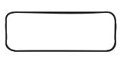
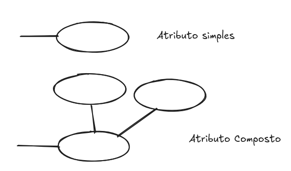
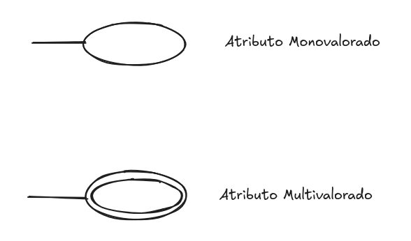
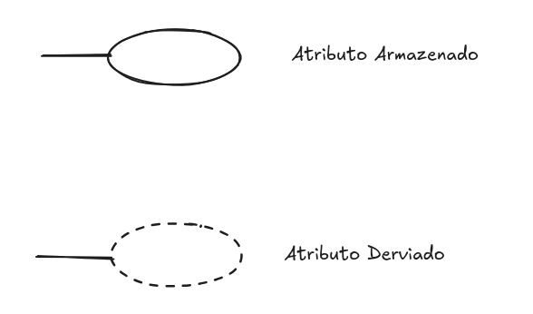
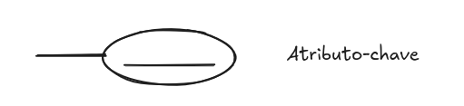

# Semana 1

# Modelagem Conceitual

O objetivo dessa modelagem é desenhar de maneria conceitual os dados envolvidos em uma aplicação e a relação entre eles. A maneira de desenha é através do **“Modelo Entidade-Relacionamento (MER)”**

Nesse modelos temos:

### Entidades

Existência física ou Conceitual

- Ex: Pessoa, carro, empresa, trabalho e etc
- Simbologia → Retângulo
    
    
    

### Atributos

Propriedades particulares que descrevem cada entidade. Além disso existem vários tipos:

- Atributos Compostos X Atributos Simples
    - Compostos → são atributos que tem subatributos ligados a ele. Ex: Endereço ( Rua, Número, Apartamento )
    - Simples → são atributos atômicos. Ex: Idade, Sexo
        
        
        
- Atributos Monovalorados x Atributos Mulltivalorados
    - Monovalorados → Possuem apenas um valor para uma instância. Ex: CPF, Data de Nascimento
    - Multivalorados → Podem assumir vários valores para uma mesma instância de entidade. Ex: telefones, Emails, Cores de produto)
        
        
        
- Atributos Armazenados x Atributos Derivados
    - Armazenados → O valor é fisicamente guardado no banco de dados, sendo informações básicas que não mudam automaticamente. Ex: Data de Nascimento, CPF
    - Derivados → O valor não é armazenado diretamente, mas sim calculado ou deduzido de outros. Ex: Idade, Valor Total, Tempo de serviço
        
        
        
- Valores Nulos (Nulls) → Quando não se sabe o valor do atributo existente.
- Atributos Complexos → Aninhamento de atributos compostos e multivalorados.
    - Ex: Uma pessoa pode ter mais de uma residência e cada uma delas pode ter múltiplos telefones.

# Tipo Entidade e Conjunto de Entidades

Um tipo entidade define uma coleção de entidades que possuem os mesmos atributos. Cada tipo de entidade é descrito por seu nome e atributos. 

A coleção de todas as entidades de um tipo entidade em particular, em um ponto no banco de dados, é chamada conjunto de entidades, que normalmente é chamado pelo mesmo nome do tipo entidade.

# Atributos-Chave

Um tipo de entidade tem, geralmente, um atributo cujos valores são distintos para cada uma das entidades do conjunto de entidade. Esse atributo é chamado de atributo-chave e seus valores podem ser usados para identificar cada entidade univocamente.

Algumas vezes, diversos atributos juntos formam uma chave, significando que a combinação dos valores dos atributos deve ser distinta para cada entidade.

Aquela entidade que não possui atributo-chave, chamos de entidade fraca.

