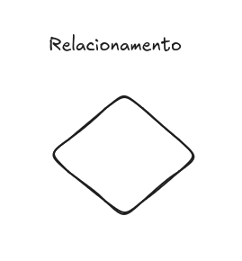
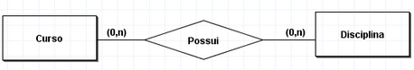
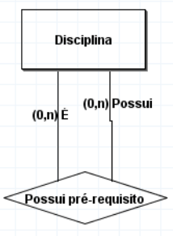
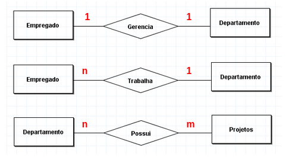
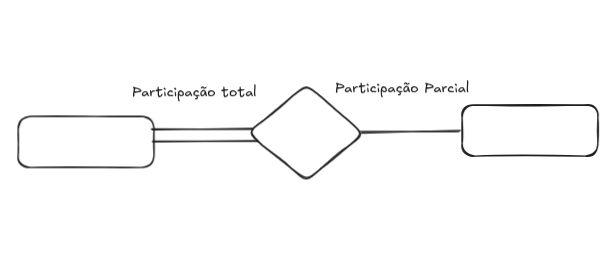
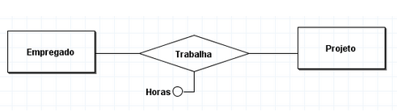
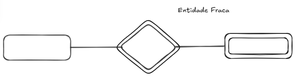

# Relacionamentos

As relações entre entidades não são feitos por atributos e sim por Relacionamentos. Esse conceito de representar representa como as entidades se conectam e interagem em um banco de dados.

# Tipo de Relacionamento

Por definição é o conjunto de associções entre entidades. Representa a interação ou o vínculo que existe entre diferentes objetos do mundo real dentro do sistema.

Exemplo: No relacionamento “Venda”, as entidades “Vendedor” e “Produto” estão associadas.

Por definição matemática, um tipo de relacionamento R entre as entidades E1, E2,…, En é um subconjunto do produto cartesiano dessas entidades:

$$
R⊆E1×E2×⋯×En
$$

De todas as combinações possíveis entre os elementos das entidades, o relacionamento R contém apenas as combinações que possuem um vínculo real no negócio.

# Grau de um Tipo Relacionamento

É o número de entidades que participam desse relacionamento ( Binário, ternário, etc.). Normalmente, os relacionamentos podem ser de qualquer grau, mas os mais comuns são os relacionamentos binários.

# Nomes e Papéis em um Tipo Relacionamento

São os nomes que representam o como aquelas entidades se relacionam, possuindo um papel sobre elas. Tecnicamente não é necessário por esses nomes, porém é interesanter nomear adequadamente os relacionamentos para maior compreensão deles.

# Relacionamentos Recursivos

É possível que o mesmo tipo entidade participe mais de uma vez em um tipo relacionamento em papéis diferentes. Nesses casos, o nome do papel torna-se essencial para definir o sentido de cada participação, sendo chamados de relacionamentos recursivos ou auto-relacionamento.

# Cardionalidade de Relacionamentos

A razão de cardinalidade para um relacionamento binário especifica o número máximo de instâncias de relacionamento em que uma entidade pode participar.

As razões de cardinalidade possíveis para os tipos relacionamento binário são:

- 1:1 → um para um
- 1:N → um para muitos
- N:1 → muitos para um
- M:N → muitos para muitos

# Restrições de Participação em Relacionamentos

Determina se a existência de uma entidade depende de sua existência relacionada à outra entidade, pelo tipo relacionamento. Essa restrição determina o número mínimo de instâncias de relacionamento em que cada entidade pode participar, e também é chamda de restrição de cardinalidade mínima.

Sendo assim há dois tipos de restrições de participação:

- Participação total → Toda entidade no conjunto total deve estar relacionada a uma entidade.
- Particpação Parcial → Nem todas as entidades precisam estar relacionadas a outra entidade

# Atributos do Tipo Relacionamento

Os tipos de relacionamento também podem ter atributos, simliares as dos tipos entidades. Além disso esse atributos, denpendendo do tpo de relacionamento, podem ser migrados para um dos tipos entidades participantes.

Para um tipo relacionamento I:N, um atributo do relacionamento pode ser migrado apenas para o tipo entidade do lado N do relacionamento.

Para tipos relacionamento M:N, alguns atributos são determinados pela combinação de entidades participantes de uma instância de relacionamento, e não por uma entidade única.

# Tipo Etindade Fraca

São entidade que não tem seus próprios atributos-chave. Normalmente são identificadas por estarem relacionadas a entidades específicas do outro tipo entidade, por meio da combinação com valores de seu atributos.

Chamamos esse outro tipo entidade identificador ou tipo entidade propriétária, sendo também chamda de tipo entidade pai ou tipo entidade dominante.

Sendo assim o tipo entidade fraca, também pode ser chamado de tipo entidade filho ou tipo entidade subordinada.

Esse tipo de relacionamento chamamos de relacionamento identificador do tipo entidade fraca.

Toda entidade fraca sempre possui uma restrição participação total em relação a seus relacionamento identificador, porém nem toda a dependência de existência resulta em um tipo entidade fraca.

Normalmente elas tem uma chave parcial, que é um conjunto de atributos que identifica, as entidades fracas que estão relacionadas a uma mesma entidade proprietária.

