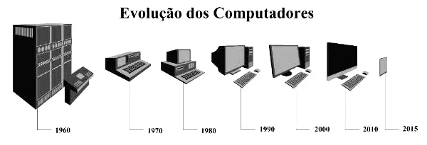
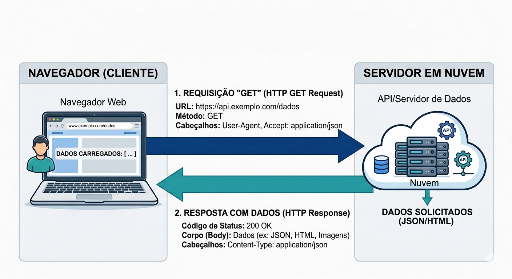
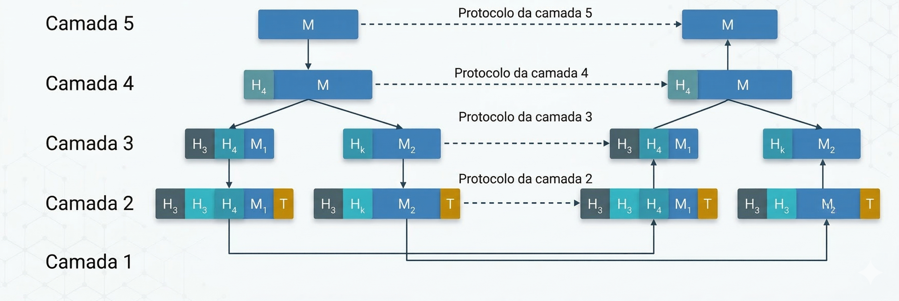
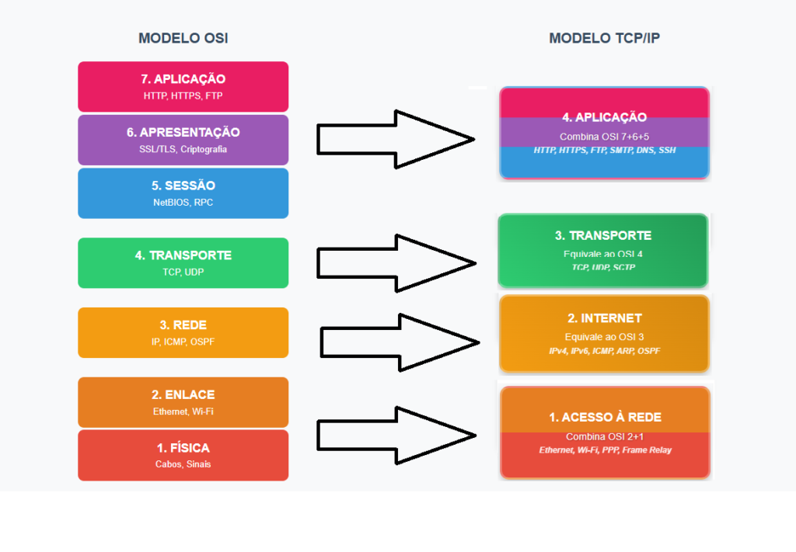

# Introdução
----
No começo da computação, na década de 1950, os computadores eram sisteams centralizados, únicos e de grande porte, operados exclusivamente por profissionais altamente especializados. Todo o processamento era feito em lotes (batch), obigando os usuários a enfrentar filas com cartões ou fitas magnéticas e aguardar longos períodos por uma resposta, sem qualquer interação em tempo real com a máquina. 

Essa realidade começou a mudar nos anos 60 com a chegada dos primeiros terminais interativos e sistemas de tempo compartilhado (time-sharing), evoluindo na década de 70 para a distribuição do processamento impulsionada pelos minicomputadores. A justificativa para conectar tudo isso nasceu do alto custo dos periféricos, que precisavam ser compartilhados, aliado à necessidade crescente de troca de informações. 

Para superar as limitações de velocidade da arquitetura sequencial clássica, surgiram arquiteturas com os sistemas multiprocessados fortemente acoplados, que dividem uma memória comum, e os fracamente acoplados, que distribuem o processamento cooperativamente. Uma rede de computadores, no fim das contas, é exatamente isso: um conjunto de módulos autônomos de processamento interconectados que preservam sua independência.

# Aplicações para redes de computadores
----
Quando um empresa decide conectar seus computadores, é principalmente extrair, corelacionar e compartilhar informações independentemente da localização física do usuário. Isso permite que os funcionários de uma empresa acesse dados hospedados em outra seda, além de viabilizar a comunicação, como e-mails e videoconferências. 

No caso dos negócios eletrônicos, as redes ajudaram na interação B2B (entre empresas), B2C (vendas para o consumidor final) e o compartilhamento P2P (ponto a ponto). Normalmente, equipamentos operam como estações de trabalho e como servidores equipados com hardwares ou softwares específicos. 

Um servidor de arquivos, por exemplo, gerencia o armazenamento e protege a integridade contra falhas, enquanto um servidor de impressão organiza filas de documentos utilizando técinas como o spooling. A rede também centraliza o compartilhamento de licenças de software e apoia o Gerenciamento Eletrônico de Docuemtnos (GED), que organiza eletronicamente dados cruciais de forma ágil e segura via navegadores. 

Outro grande protagonista são os servidores de banco de dados, que processam consultas complexas localmente e transmitem apenas os resultados pela rede, otimizando drasticamente o tráfego.

# Modelo cliente-servidor
----
A dinâmica mais comum na comunicação das aplicações de rede atua através do modelo cliente-servidor, no qual os hospedeiros são conectados entre si. Nele, os dados repousam em máquinas robustas chamadas de servidores, enquanto os usuários utilizam seus computadores para acessar essas informações remotamente. 

O fluxo é simples e direto: um processo rodando no cliente envia uma mensagem pela rede com uma solicitação e aguarda, enquanto o processo no servidor recebe o pedido, executa o trabalho correspondente e envia a resposta de volta. Como os sistemas operacionais modernos lidam com a multiprogramação, é absolutamente comum que um único hospedeiro execute simultaneamente vários processos clientes e múltiplos processos servidores.

# Tipos de rede
----
Para entender a topologia da internet, as rede são dividas em duas grandes categorias: **escala** e **tecnlogia de transmissão**. Olhando para a transmissão, existem as redes de difusão (broadcast), ideais para ambientes menores, onde há apenas um canal de comunicação compartilhando a mensagem de um é recebida por todas simultaneamente. 

Do outro lado, temos as redes ponto a ponto, focadas em grandes escalas, que conectam pares individuais de computadores e dependem fortemente de algoritmos de roteamento para que os pacotes encontrem seu caminho através de nós intermediários. 

Analisando a escala geográfica, as **Redes Locais (LANs)** conectam equipamentos em edifícios ou campi com altíssimas taxas de transmissão e baixo atraso, as **Rede Metropolitanas (MANs)** podem cobrir uma cidade inteira mesclando dados e mídia, e as **Redes Geograficamente Distribuídas (WANs)** igam continentes inteiros utilizando linhas de transmissão pesadas e roteadores de comutação.

# Redes sem fio
----
A flexibilidade do wireless divide-se primariamente em três de atuação: 

**A interconexão de sistemas** cuida das ligações de alcance limitadíssimo, utilizando o paradigma mestre-escrevo do padrão **Bluetooth**, onde o mestre determina o ritmo, as frequências e as permissções de transmissão. 

Subindo a escala, encontramos as **LANs sem fio**(o nosso WI-FI), onde computadores com modems de rádio se comunicam através de uma antena central que funciona como ponto de acesso para os hospedeiros.

Por fim, as **WANs sem fio** entram em campo em áreas geograficamente distribuídas de longa distância, tendo a infraestrutura de dados da telefonia celular como seu principal e mais notório exemplo de operação.

# Protocolos de comunicação
----
Interligar máquinas de arquiteturas completamente distintas só é possível porque o projeto das redes foi inteligentemente organizado em um hierarquia de camadas empilhadas. A regra de outro é: o único objetivo de uma camada é fornecer serviços simplificados para a camada que está a cima dela, ocultando totalmente a complexidade técnica de sua implementação. Quando duas máquinas conversam, as entidades de mesma camada em equipamentos diferentes, chamados de entidades pares, dialogam utilizando regras estritas conhecidas como protocolos.

No entando, os dados não "voam" de uma camada para outra horizontalmente; cada nível repassa os pacotes para a camada imediatamente inferior até atingirem o meio físico, onde a elétrica ou óptica realmente acontece. A junção bem definida dessas camadas de protocolos forma a arquitetura da rede, operando através de provedores e usuários de serviço que se conectam em portas lógicas chamadas de SAPs (Pontos de Acesso ao Serviço).

# Modelo de referência OSI
----
A ISO propôs o Modelo OSI (Interconex~~ao de Sistemas Abertos) como um guia de sete camadas para a padronização internacional. É crucial entender que ele é um modelo de referência e não uma arquitetura engessada; ele não diz qual protocolo usar, apenas dita as obrigações e o que cada camada deve executar.
- **Camda Física** -> Cuida dos volts da duração dos sinais e da transmissão bruta dos bits no cabo
- **Camada de Enlace de dados** -> Tenta transformar essa via ruidosa em um canal livre de falhas, criando quadros, identificado limites e resolvendo danos na transmissão.
- **Camada de Rede** -> Assume o roteamento do pacote, descobrindo como enviá-lo da origem ao destino, resolvendo gargalos e lidando com endereçamentos lógicos.
- **Camada de Transporte** -> Recebe tudo, fragmenta e passa adiante, isolando os níveis superiores de dores de cabeça como pacotes perdidos ou entregues fora de ordem, servido de ponte direta fim a fim.
- **Camada de Sessão** -> Gerencia as conversas, impedindo atropelos de requisições simultâneas e marcando pontos de sincronização para retomadas em caso de queda.
- **Camada de Apresentação** -> Traduz a sintaxe, criptografia a segurança e comprime o tamanho, resolvendo diferenças entre máquinas diversas.
- **Camada de Aplicação** -> Hospeda os processos do usuário e dá entrada para o mundo palpável do software e dos serviços de rede. E mesmo com a viagem vertical do dado até o hardware, tudo na programação é pensando de forma horizontal.

# Arquitetura TCP/IP
----
Foi movida pela urgência da defesa americana, sendo baseada na antiga rede de pesquisa ARPANET, essa arquitetura surguiu da necessidade de conectar múltiplas redes mantendo a infraestrutura resistente a destruições físicas ou quedas repetinas de rotas.

Composta por apenas quatro divisões, a arquitetura foi moldada a partir de protocolos que já existiam na prática. O andar superior abriga a **Camada de Aplicação**, agrupando protocolos de alto escalão do dia a dia da web como o HTPP,FTP,SMTP e DNS.

A **Camada de Transporte** garante o papo fim a fim usando o imbatíivel TCP para envios perfeitos e sem erros (embora ligeiramente mais lentos devido à checagem constante), e o despojado UDP, que é não confiável, não possui conexão, mas reina soberano onde a integra imediata vale mais que a precisão.

O pilar central de toda a arquitetura é a **Camada Inter-redes**, responsável por injetar de forma oficial o pacote IP e fazê-lo navegar roteado por qualquer tipo de terreno para chegar ao seu objetivo.

No nível inferior reside a **Camada Host/Rede**, um campo aberto focado unicamente no protocolo nativo da máquina para conectá-la ao cabo ou rádio sem definir restrições universais.

# Internet
----
Ela é composta pela sua periferia, abrigando sistemas finais como servidores pesasdos em datacenters gigantes e as centenas de bilhões de clientes na forma de notebooks, smartphones e caros conectados. Para que essa borda faça contato com o núcleo, esses hospedeiros acessam os Provedores de Serviços de Internet (ISPs) regionais e globais, trafegando os dados em pacotes por comutadores complexos e enlaces vigorosos.

No fim do dia, a comunicação bem-sucessidade, como o simples ato de um script solicitar um website na porta 80, só ocorre porque protocolos estruturados garantem o formato, as ações recebidas e a ordem exata de envio dessa fantástica rede global.