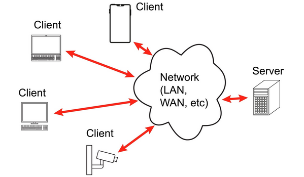
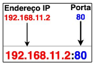
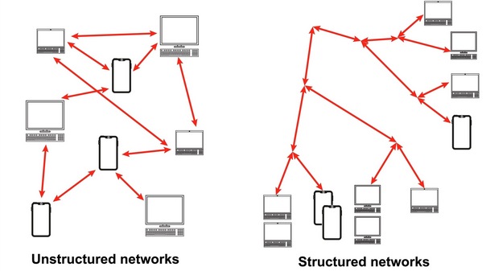
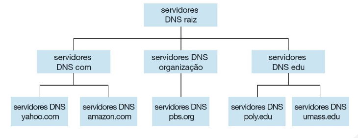
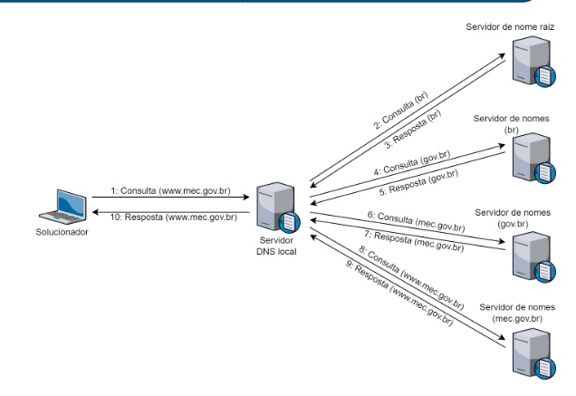

# Comutação de pacotes

É uma técnica de comunicação de rede onde as mensagens longas são fragmentadas em pedaços menores chamados de **pacotes** antes de serem enviadas. Esses pacotes percorrem a rede de forma independente, passando por diversos dispositivos intermediários (como roteadores) até chegarem ao destino final, onde são reagrupados para formar a mensagem original.

Como funciona

1. **Fragmentação e Store and Forward** → Assim que você envia um dado, ele é quebrado em pacotes. Cada roteador no caminho utiliza a técnica Strore and Forward ( Armazenar e encaminhar ), onde ele precisa receber o pacote inteiro, conferir e logo após passá-lo adiante.
2. **Independência dos Pacotes** → Cada pacote é como um viajante independente. Dependendo do tráfego da rede, o pacote 1 pode ir pelo “Caminho A” e pacote 2 pelo “Caminho B”. Eles decidem a rota baseados nas condições da rede naquele exato momento
3. **Tabelas de repasse →** Em cada esquina da rede, existe um roteador com uma Tabela de repasse. Ele olha o endereço de destino do seu pacote e consulta essa tabela para decidir qual é a melhor saída para esse pacote chegar mais rápido.
4. **Buffers e Filas** → Se muitos pacotes chegam ao mesmo tempo em roteador, eles vão para uma fila de espera chamada **Buffer.** Se essa fila lotar, o roteador não tem escolha: ele descarta os pacotes novos, gerando a famosa perde de pacotes.

# Camada de Aplicação

Essa é camada onde temos as interface direta entre o usuário e a rede de computadores. Em termos simples, é onde “as coisas acontecem” para o usuário final: é nela que residem as aplicações e serviços que dão sentido à existência de toda a infraestrutura de rede.

É nela que fornece os protocolos que permitem que softwares enviam e recebam informações pela rede. Além disso temos protocolos públicos, definidos em documentos chamados RFCs e protocolos proprietários, cujo funcionamento não é aberto.

Nessa camada a aplicação se comunica com a camada de transporte através de uma “porta” lógica chamada **socket,** que funciona como a API entre o programa e a rede.

Podemos citar alguns exemplos de protocolos:

- **Web:** Utiliza o protocolo HTTP
- **E-mail:** Utiliza protocolos como SMTP, POP3 e IMAP
- **Transferência de Arquivos:** Utiliza o FTP
- **Streaming e Vídeo:** Utiliza UDP , HLS e MPEG-DASH

# Princípios de aplicações de rede

Esses princípios estabelecem que o desenvolvimento de software de rede deve ocorrer exclusivamente nos sistemas finais (hosts). Isso significa que ao criar um app, você escreve código para o seu computador ou para o servidor, mas nunca para os roteadores ou switches que ficam no meio do caminho.

# Arquiteturas de aplicação de rede

Ela é projetada pelo programador e determina como a aplicação é organizada nos vários sistemas finais. As arquiteturas mais utilizadas são: **Cliente-servidor** e **P2P**

Na arquitetura Cliente-servidor é modelo mais comum na internet, onde existe uma divisão clara de papéis:

- **Servidor** → Esse é hospedeiro que está sempre ligado, possui um **endereço IP permanente** para que todos saibam onde encontrá-lo.
- **Clientes** → Comunicam-se diretamente com o servidor, podendo estar conectado de forma ligada ou desligada. Podem ter endereço de IP dinâmicos.

Na Arquitetura P2P não existe um servidor central mandando em tudo, então ele funciona:

- Não há um servidor sempre ligado no centro.
- Os sistemas finais (hosts) se comunicam diretamente entre si
- Esses sistemas são chamados de Pares (Peers)

Uma vantagem nesse sistema é auto-escalabilidade, já que a cada usuários que entra na rede mais capacidade de serviço ela tem, pois cada novo par também compartilha recursos não apenas consome. 

A desvantagem é que ela é mais complexa de gerenciar, pois os pares mudam de endereço IP e entram/saem da rede o tempo todo (Churn)

# Comunicação entre processos

Um processo é basicamente um programa que está rodando em um hospedeiro (host). Quando dois processos estão no mesmo computador, eles se comunicam usando mecanismos do Sistema Operacional. Mas, quando estão em computadores diferentes, eles se comunicam através de troca de mensagens pela rede.

A comunicação é definida pelos papéis que cada processo assume:

- Processo Cliente: É aquele que inicia a comunicação, fazendo a **requisição**
- Processo Servidor: É aquele que espera para ser contatado, **respondendo** à requisição

Toda essas mensagens é enviada e recebida através de uma interface de software denominada **socket.** Ele fica entre a camada de aplicação e a camada de transporte. Além disso, o socket pode ser denominado como **interface de programação da aplicação ( API )** entre a aplicação e a rede.

Para identificar o processo receptor, duas informações devem ser especificadas: O endereço do hospedeiro e Um identificador que especifica o processo receptor no hospedeiro de destino.

Na internet, cada hospedeiro é identificado por seu endereço IP que é o endereço de 32 bits (IPV4) que identifica a máquina na rede. Além do endereço, temos que saber a porta de cada programa, já que uma máquina pode rodar vários programas ao mesmo tempo. Sendo assim cada serviço recebe um número de porta, com o IP identificado.

# Serviços de transporte providos pela Internet

São o contrato de entrega de dados, que dependendo da função da sua aplicação você escolherá um serviço que preza pela velocidade (UDP) ou pela confiabilidade (TCP)

O serviço TCP é cuidadoso com os dados e orientado à conexão, temos características:

- **Confiabilidade:** Ele garante que todos os dados cheguem e na ordem correta. Se algo acontecer com o pacote, ele pede para reenviar.
- **Serviço Orientado para Conexão:** Antes de trocar dados, o cliente e o servidor precisam realizar um “aperto de mão” (handshake) para preparar a sessão.
- **Controle de Congestionamento:** Possui mecanismo que diminuem a taxa de envio quando a rede está sobrecarregada, visando o “bem-estar geral” da internet

Já no serviço UDP é focado na velocidade, sendo suas características:

- **Não orientado à Conexão:** Não há fase de preparação; os dados são enviados imediatamente.
- **Serviço não confiável:** Não garante que os dados cheguem ao destino nem que cheguem na ordem certa.
- **Sem controle de congestionamento:** Envia dados na taxa que a aplicação desejar, o que pode causar perda de pacotes se o enlace estiver saturado.

## DNS

É uma base de dados distribuída e hierárquica, além de ser um protocolo da camada de aplicação. Sua principal função é a resolução de nomes, ou seja, traduzir um nome de domínio para um endereço IP que as máquinas consigam entender.

O DNS não fica em um único computador ( isso seria um desastre se ele falhasse). Ele é organizado como uma árvore invertida. Nele temos os espaço de nomes, que são divido em domínios onde são estruturados em níveis.

Nível 0: Raiz (Root)

- É o **topo da hierarquia**.
- Representado por um ponto (`.`) no final dos endereços (que normalmente fica oculto).
- Sua função é indicar quais servidores cuidam dos domínios de nível superior (TLDs).

**Nível 1: Domínios de Nível Superior (TLD - Top-Level Domains)**

Informa a categoria ou a localização do domínio. Divide-se em dois tipos:

- **Domínios Genéricos (gTLD):** Informam o tipo de organização.
    - *Exemplos:* `.com` (comercial), `.edu` (educacional), `.org` (organizações sem fins lucrativos).
- **Domínios de Países (ccTLD):** Indicam a origem geográfica.
    - *Exemplos:* `.br` (Brasil), `.pt` (Portugal), `.jp` (Japão).

Nível 2: Nome do Domínio (Second-Level Domain)

- É o **nome principal** escolhido pela entidade ou empresa.
- *Exemplo:* Em `google.com.br`, o nome "google" é o domínio de segundo nível sob o registro `.com.br`.

Nível 3: Subdomínios

- São subdivisões criadas pelo dono do domínio para organizar seus serviços.
- *Exemplo:* `www` (servidor web), `mail` (servidor de e-mail), `blog`.

Cada componente do domínio são separados por pontos e cada domínio controla como são criados seus subdomínios.

Além disso os nomes de domínio não fazem distinção entre letras maiúsculas e minúsculas. O DNS é implementado sobre o protocolo UDP.

Agora no caso de resolução desses nomes, já que o ddns não faz a parte de resolução desses nomes, cada cliente executa um software conhecido como solucionador (Resolver) onde ele vai encontrar o endereço associado ao nome e repassar para o servidor DNS.

Existe algumas resolução do que pode acontecer:

1. O servidor DNS é o responsável pela zona.
2. O servidor DNS não é responsável pela zona, mas possui a resolução em cache.
3. O servidor DNS não é o responsável pela zona e não possui a resolução em cache

Assim nenhum servidor DNS isolado tem todos os mapeamentos para todos os hospedeiros da Internet, sendo os mapeamentos distribuídos pelos servidores DNS.

O Dns provê 2 tipos de consultas:

- Consulta recursiva → Quando a consulta retorna a resolução do nome de forma completa, sem retornar respostas parciais
- Consulta iterativa → Quando para obter uma resposta completa é necessário realizar uma série de iterações com servidores, obtendo várias respostas parciais

