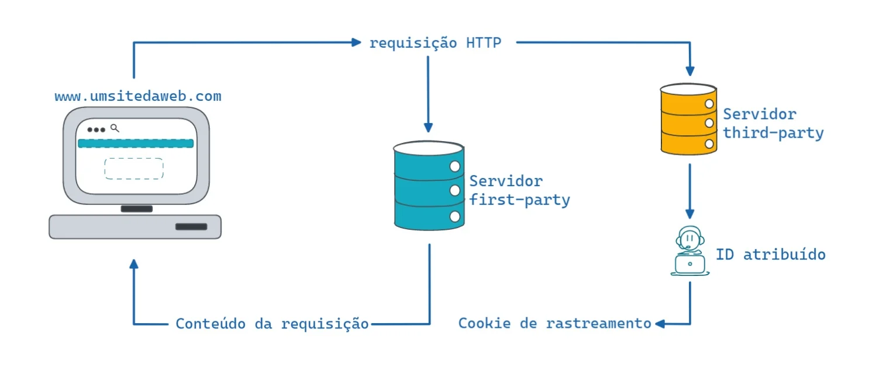
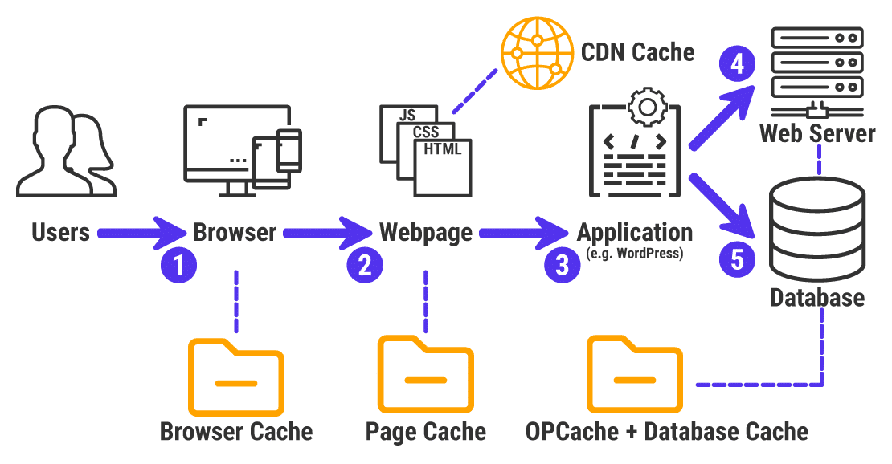
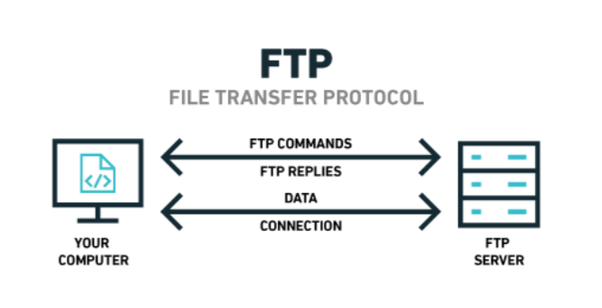
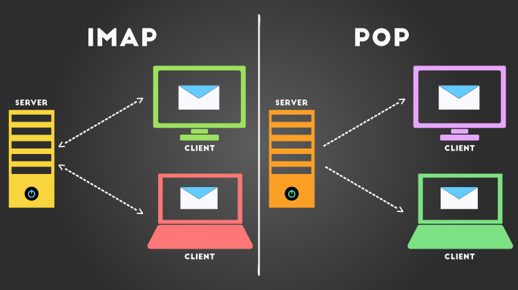

# WEB

É uma estrutura que permite acesso a documentos vinculados (objetos) espalhados por milhares de hospedeiros na Internet. Diferente da Internet, que é a rede física e seus protocolos de base sendo IP e TCP, a Web é o conjunto de informações e o sistema de navegação que utilizamos por meio dos navegadores.

Ela se baseia-se em dois pilares principais: **Objetos** e o **Protocolo HTTP**

1. **Objetos e Páginas Web**: Uma página Web é constituída de vários objetos, como arquivos HTML, imagens JPEG, applets Java , clipes de vídeo ou etc. O arquivo HTML base referencia esses outros objetos através de suas URLS ( Uniform Resoure Locators )
2. **A URL**: Cada URL possui dois componentes básicos que indicam ao navegador onde buscar o conteúdo:
    - O nome do hospedeiro que abriga o objeto ( ex: `www.exemplo.com.br` ).
    - O nome do caminho do objeto dentro desse servidor ( ex: `/fotos/imagem.png` ).
3. **HTTP ( HyperText Transfer Protocol ):** É o protocolo da camada de aplicação que define como as mensagens são trocadas entre o cliente ( navegador ) e o servidor Web.

# HTTP ( HyperText Transfer Protocol )

É o protocolo da camada de aplicação que rege a comunicação na Web. Ele define como clientes ( navegadores ) e servidores trocam mensagens para solicitar e entregar objetos ( arquivos HTML, imagens, vídeos, etc).

A comunicação se baseia num ciclo de Resquest ( Requisição ) e Reponse ( Resposta ), utilizando texto ASCII simples. Quando um usuário faz uma requisição à uma página WEB o navegador envia ao servidor mensagens de requisição HTTP para os objetos da página. Assim que o servidor recebe as requisição, ele responde com mensagens de resposta HTTP que contêm os objetos.

O HTTP usa o TCP como seu protocolo de transporte, ou seja, ele não precisa se preocupar com dados perdidos ou detalhes de como se recuperar da perda de dados ou os reordenar.

O servidor envia ao cliente os arquivos solicitados sem armazenar qualquer informação de estado sobre o cliente, assim o HTTP é denominado um **protocolo sem estado.**

A conexão da aplicação pode ser persistentes , não persistentes ou ambas, quem decide isso é o programador. Se for persistentes, todas as requisição e suas repostas serão enviadas por uma mesma conexão TCP ( **Fica aberto a conexão** ). No caso de não persistente o par de requisição/resposta será enviado por uma conexão TCP distinta ( **Fecha e abre a cada conexão** ). 


# Formato da mensagem HTTP

A mensagem de requisição é escrita em texto ASCII comum, sendo a primeira linha denominada de **linha de requisição** e as linhas subsequentes são denominadas linhas de cabeçalho. Além disso a linha de requisição tem três campos: **Método, URL** e **Versão do HTPP.**

O Método pode assumir vários valores diferentes entre eles:

- GET → Solicita a leitura de uma página da Web
- HEAD → Solicita a leitura de um cabeçalho de página Web
- PUT → Solicita o armazenamento de uma página da Web
- POST → Acrescenta a um recurso
- DELETE → Remove um recurso
- LINK → Conecta dois recursos existentes
- UNLINK → Desfaz uma conexão entre dois recursos

```
HTTP/1.1 200 OK
Connection: close
Date: Tue, 09 Aug 2011 15:44:04 GMT
Server: Apache/2.2.3 (CentOS)
Last-Modified: Tue, 09 Aug 2011 15:11:03 GMT
Content-Length: 6821
Content-Type: text/html

(Entity Body)
```

# Cookies

Como um servidor HTTP não tem estado, os cookies vieram para solucionar isso. Eles são definidos no RFC 6265 e permitem que sites monitorem seus usuários. A maioria dos sites comerciais utilizam os cookies.



# Cache Web ( servidor proxy )

É uma entidade da rede que tem sua própria unidade de armazenamento e mantém cópias de objetos recentemente requisitados. O navegador estabelece uma conexão com o cache Web e envia a ela uma requisição HTPP para o objeto.

Quando isso acontece, o cache verifica se tem uma cópia do objeto armazenada localmente. Se tiver, envia o objetivo ao navegador do cliente, dentro de uma mensagem de resposta HTTP. Caso ele não tiver o objeto, o cache abre uma conexão TCP com o servidor Web, envia uma requisição HTTP e aguarda que o servidor envie o objeto dentro de uma resposta HTTP. Ao receber, o cache guarda uma cópia em seu armazenamento local e envia outra mensagem.



# GET condicional

Serve como mecanismo que permite que um cache verifique se seus objetos estão atualizados. Para ser uma mensagem de GET condicional caso:

- Usar o método GET
- Possuir uma linha de cabeçalho: “If-Modified-Since”.
- Quando o cache Web recebe uma solicitação e já possui o objeto, envia uma solicitação contendo a data do objeto que possui em cache.
    
    ```
    GET /fruit/kiwi.gif HTTP/1.1
    Host: www.exotiquecuisine.com
    If-modified-since: Wed, 7 Sep 2011 09:23:24 
    ```
    
- Caso não tiver alteração no objeto o servidor responde com uma mensagem contendo o corpo do objeto vazio.
    
    ```
    HTTP/1.1 304 Not Modified
    Date: Sat, 15 Oct 2011 15:39:29
    Server: Apache/1.3.0 (Unix)
    (corpo de mensagem vazio)
    ```
    

# FTP ( Transferência de arquivo )

Protocolo da camada de aplicação usado para transferir arquivos entre um hospedeiro local (cliente) e um hospedeiro remoto (servidor). Ele permite que um usuário interaja com um sistema de arquivos remoto (listar diretórios, baixar, enviar ou apagar arquivos).

O FTP utiliza duas conexões TCP paralelas:

- **Conexão de controle →** É usada para enviar comandos e receber as respostas do servidor. Ele permanece aberta durante toda a sessão.
- **Conexão de Dados** → É abertura apenas quando um arquivo precisa ser transferido de fato. Assim que o arquivo terminar de passar, essa conexão é fechada.



# Correio eletrônico

Os correios eletrônicos, ou chamados E-mails, existem três componentes principais:

1. **Agentes de Usuário ( User Agents )** → É o programa que você usa para ler e escrever.
2. **Servidores de Correio ( Mail Servers )** → Cada usuário tem uma caixa de correio (mailbox) localizada em um servidor
3. **Protocolos** → **SMTP** usado para enviar mensagens entre servidores e **POP3 / IMAP** para receber/baixar as mensagens do servidor para o seu computador.

# SMTP

É uma tecnologia antiga que possui certas características arcaicas. Exemplo: restringe o corpo e o cabeçalho de todas as mensagens ao simples formato ASCII de 7 bits.

Mesmo assim ele é o protocolo padrão para transferência de correio eletrônico na Internet. Ele define como as mensagens são movidas de um servidor de e-mail para outro através do TCP ( geralmente na porta 25).

O funcionamento é bem simples, o usuário utilizar um Agente de usuário para escrever um e-mail. O agente envia a mensagem para o servidor de correio via SMTP. O servidor coloca a mensagem em uma fila, logo depois o servidor abre uma conexão TCP com o outro servidor do destinatário e entrega a mensagem via SMTP. No final o servidor coloca a mensagem na Caixa de correios e o destinatário usa o agente para baixar a mensagem, usando o POP3 ou IMAP

# Formato da mensagem

Ao enviar um e-mail, tem um cabeçalho contendo informações periféricas antecede o corpo da mensagem em si. O corpo e o cabeçalho são separados por uma linha em branco. 

Todo cabeçalho tem uma linha FROM e uma TO, e pode incluir uma Subject. Sendo os principais campos de cabeçalho são:

- To → O endereço de correio do destinatário principal
- Cc → O endereço de correio do destinatário secundário
- Bcc → O endereço para cópias carbono cegas
- From → quem criou a mensagem
- Sender → Endereço de correio eletrônico do remente
- Received → Linha que é incluída por cada agente de transferência durante o percurso
- Return-Path → Identifica o endereço de e-mail para onde enviar relatórios de erros em caso de falha na entrega

# Protocolos de acesso

Os protocolos mais comuns par ao recebimento de mensagens pelo usuário final são o POP3 ( Post Office Protocol version 3) e o IMAP ( Internet Mail Acess Protocol). Vamos detalhar cada um para entender melhor:

### POP3

- Usado para acessa a partir de um único computador (Local)
- Estabelece uma conexão TCP com o servidor na porta 110
- Depois da conexão passa por três estados:
    - Autorização → Lida com o login
    - Transações → Lida com a coleta de mensagem e com marcação das mensagens para exclusão
    - Atualização → Faz com que as mensagens marcadas para exclusão sejam efetivamente excluídas.
- Pode baixar mensagens específicas e também eliminar apenas as mensagens que não são mais desejadas.

### IMAP

- Todas as mensagens permanece no servidor e ele fornece mecanismos para leitura de mensagens ou partes de mensagens.
- Fornecer mecanismos para criar, destruir e manipular várias caixas de correio no servidor.
- Espera a conexão na porta 143

