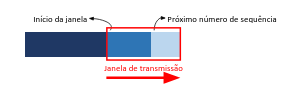

# Semana 4

Serviços e princípios dos protocolos de transporte. Transporte não orientado à conexão: UDP

# Camada de transporte

O objetivo dessa camada é promover a **confiabilidade** na transferência de dados entre o hospedeiro origem e o hospedeiro destino, independente das redes físicas em uso. Também cabe à aplicação decidir se usará este serviço confiável ou um serviço não confiável.

Tanto no modelo OSI enquanto o TCP/IP a camada de transporte situa-se logo acima da camada de rede. A única diferença é que no modelo OSI, a camada que utiliza os serviços dessa camada é a camada de sessão que logo após é utilizada pela camada de apresentação, assim para chegar na cada da aplicação. No caso do TCP/IP, não implementa essas duas camadas, sessão e apresentação, assim cabe a camada de aplicação implementar se for necessário.

Ela fornece comunicação lógica, e não física, sendo assim tudo se passa como se os hospedeiros que executam os processos estivessem conectados diretamente.

Além disso uma rede de computadores pode disponibilizar vários protocolos de transporte. Os mais utilizados na internet são o TCP que garante a entrega de fluxo de bytes confiável e o UDP não oferece garantia de entrega, e cada dados trocados pela camada são denominados segmentos.

# Endereçamento

Tem como função identificar a qual processo determinada mensagem deve ser entregue no hospedeiro, assim todo protocolo de transporte carrega o endereço do processo para o qual esta mensagem deve ser entregue, sendo mais conhecido como P**orta.**

# Multiplexação e demultiplexação

São os processos que permitem que a rede entregue dados não apenas para a máquina correta (o que é função da Camada de Rede), mas para o **processo (aplicação)** correto dentro dessa máquina.

- **Multiplexação** → Acontece no hospedeiro de **origem**. É o trabalho de reunir dados de diferentes aplicações, adicionar cabeçalhos (como as portas) para criar segmentos e passá-los para a camada de rede.
- **Demultiplexação** → Acontece no hospedeiro de **destino**. É a tarefa de receber o segmento da camada de transporte e entregá-lo ao socket (porta) correto da aplicação correspondente.

# Serviços com conexão e sem conexão

Como a camada de transporte, tem como objetivo oferecer um serviço confiável e eficiente a seus usuários, ela deverá oferecer, pelo menos, um serviço com conexão e um serviço sem conexão.

- **Serviço de transporte com conexão** → Verifica quais dados chegam com erro ao destino e, até mesmo, os que não chegam, sendo capaz de retransmitir estes dados repetidas vezes até que estejam corretos.
- **Serviço de transporte sem conexão** → Não existe nenhum controle sobre os dados enviados, mesmo que um segmento se perca ou não chegue no destino nada será feito para recuperação.

# UDP ( User Datagram Protocol )

É o protocolo de transporte não orientado para conexão, não garante a entrega das mensagens no destino e não garante as mensagens cheguem na ordem em que foram enviadas. O objetivo é ser um protocolo rápido na entrega das mensagens no destino.

Vantagens:

- Melhor controle no nível da aplicação sobre quais dados são enviados e quando.
- Não há estabelecimento de conexão
- Não há estados de conexão
- Cabeçalho pequeno

# Interface orientada a mensagem

O UDP é um protocolo orientado a mensagem. Sempre que recebe uma mensagem da camada superior, a envia inteira em um única segmento UDP. Assim uma mensagem nunca é divida em vários segmentos diferentes e nem unida a outra para ser envida juntas.

Os problemas que podem acontecer por utilizar o IP como protocolo da camada de rede, são:

- Possibilidade de perda de mensagens
- Possibilidade de que algumas mensagens cheguem duplicadas ou/e fora de ordem.

# Estrutura do segmento UDP

Ele é formado pela porta origem e porta destino, que identifica os processos nos hospedeiros origem e destino. Por meio desses campos que se realiza a multiplexação/demultiplexação.

Depois da porta de origem temos o comprimento, que especifica o tamanho do segmento e incluindo o cabeçalho. Para saída no destino, temos a soma de verificação que tem a função de garantir que a mensagem chegue ao destino livre de erros.

# Transferência confiável de dados

A camada de transporte funciona utilizando os serviços oferecidos pela camada de rede, onde não pode fazer nenhuma suposição sobre a confiabilidade desta camada.

Assim cabe ao serviço de transporte corrigir todos esses problemas e entregar os dados no destino livres de erros e na correta ordem em que foram enviados.

A maneira mais comum de garantir a entrega confiável é dar ao transmissor alguma informação sobre a recepção dos dados. Normalmente o receptor retorna informações de controle com confirmações positivas ou negativas sobre os dados recebidos.

- Confirmação positiva → Confirma que os dados foram recebidos com sucesso
- Confirmação negativa → Avisa de que houve erro na recepção de dados

Essa informação pode ser transmitida em um campo de controle no cabeçalho do protocolo, tecnicamente conhecida como **piggybacking**.

# Bit alternante

O protocolo é bem simples, sendo capaz de realizar uma transferência confiável de dados entre dois hospedeiros, ele envia um segmentos e o transmissor dispara um temporizador  que fica no aguardo por uma confirmação.

Caso seja uma confirmação negativa ou o tempo se esgote, o reinicia o temporizador e retransmite o segmento até que chegue uma confirmação positiva.

Como existe apenas um segmento em trânsito, basta um único bit para diferenciar uns segmento do outro, assim conhecido como bit alternante. Um exemplo de protocolo que utiliza essa técnica é o TFFTP.

# Transferência de dados com paralelismo

A fim de aumentar o desempenho surgiu a ideia de permitir que sejam enviados novos segmentos mesmo que os anteiros não tenham sido confirmados, já que no modelo bit alternante demorava muito até confirma cada segmento.

Para isso era necessário aumentar a faixa de valores que compõem os números de sequência e o transmissor deve possuir buffers suficientes para armazenar todas as mensagens que ainda não foram confirmadas.

Com isso tudo, a retransmissão é trada dá origem por duas técnicas:

- Go-Back-N → Onde todos os segmentos a partir do que não foi confirmado são retransmitidos
- Repetição Seletiva → São retransmitidos apenas os segmentos não confirmados.

Ainda sim há uma quantidade limite de segmentos que podem ser enviados, sendo a máxima quantidade que podem ser transmitidos definido pelo tamanho da **janela de transmissão**.

# Go-Back-N

É um protocolo de janela deslizante de tamanho N, assim permitindo o envio de até N segmentos sem necessidades de confinação, sendo necessário buffers suficientes para armazenar esses N segmentos.

Quando é solicitado uma transmissão o transmissor verifica se há espaço na janela de transmissão. Sendo assim, o envio se ha espaço e sendo bloqueado se não espaço até que seja liberado.

# Repetição seletiva

Nesse caso, o protocolo não faz a retransmissão de todos os segmentos quando ocorre um erro. Somente os segmentos perdidos são retransmitidos, sendo necessário que cada segmento seja confirmado individualmente.

# TCP: o protocolo de transporte com conexão da Internet

É o protocolo orientando à conexão, sendo perfeito para aplicações que necessitam trocar grande quantidade de dados através de uma rede com múltiplos roteadores. Ele oferece um fluxo de bytes fim a fim confiável. 

Características:

- Orientado à conexão
- Confiável
- Ponto a ponto
- Full-duplex ( Podem ser transferidos de qualquer sentido )
- Fluxo de bytes
- Finalização suave

Mecanismos utilizados:

- Soma de verificação
- Temporizador
- Número de sequência
- Reconhecimento positivo
- Janela/paralelismo

# Formato do segmento TCP

O formato do segmento consiste em um cabeçalho de tamanho fixo de 20 bytes, que pode ser seguido por campos de opções e, finalmente, os dados provenientes da aplicação.

1. Portas de origem e destino → Identificam quais processos nas máquinas estão se comunicando.
2. Número Sequência → Indica a posição do primeiro byte do segmento no fluxo total de dados.
3. Número de reconhecimento/confirmação → Chamado de ACK, indica ao remetente qual é o próximo byte que o receptor espera receber.
4. Comprimento do cabeçalho → Informa o tamanho do cabeçalho.
5. Flags → São as bandeiras que indicam o propósito do segmento
    - **SYN:** Usado para iniciar uma conexão.
    - **ACK:** Indica que o campo de número de reconhecimento é válido.
    - **FIN:** Usado para encerrar a conexão.
    - **RST:** Reseta a conexão se houver erro grave.
    - **PSH e URG:** Lidam com prioridade e entrega imediata.
6. Janela de Recepção → Usada para o controle de fluxo.
7. Soma de verificação → Um código matemático usado para conferir se os bits do cabeçalho ou dos dados sofreram alguma alteração durante a viagem pela rede.